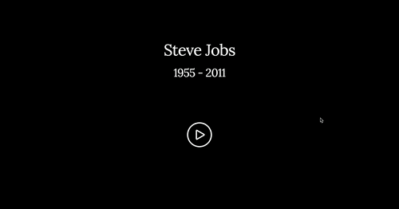

# tribute-page
A Steve Jobs tribute page as a [Free Code Camp](https://www.freecodecamp.com/challenges/build-a-tribute-page) front-end project where I show some information about the Apple creator life. Made using [HTML5](https://developer.mozilla.org/es/docs/HTML/HTML5), [CSS3](https://developer.mozilla.org/es/docs/Web/CSS/CSS3), [Skeleton](http://getskeleton.com/) for code, and [Photoshop](http://www.adobe.com/es/products/photoshop.html) for design.

Discover more about this project on this [blog post](http://jorgesanz.xyz/2016/03/25/website-steve-jobs-tribute-page/) where I tell you the story behind this, some feedback messages I have received and more... 🙂

- [Page](http://jorge-sanz.github.io/tribute-page/) - Final result of the project
- [Design](https://github.com/jorge-sanz/tribute-page/blob/gh-pages/art/tribute-page.png) - Website design made in Photoshop

## Development
### Getting started
1. Enter in the repo directory in local by terminal
2. Use the command: `sudo python -m SimpleHTTPServer 80`
3. Open your browser with this address: `http://localhost`

## Built with
- [HTML5](https://developer.mozilla.org/es/docs/HTML/HTML5)
- [CSS3](https://developer.mozilla.org/es/docs/Web/CSS/CSS3)
- [Skeleton](http://getskeleton.com/)
- [Photoshop](http://www.adobe.com/es/products/photoshop.html)
- [Github Pages](https://pages.github.com/)
